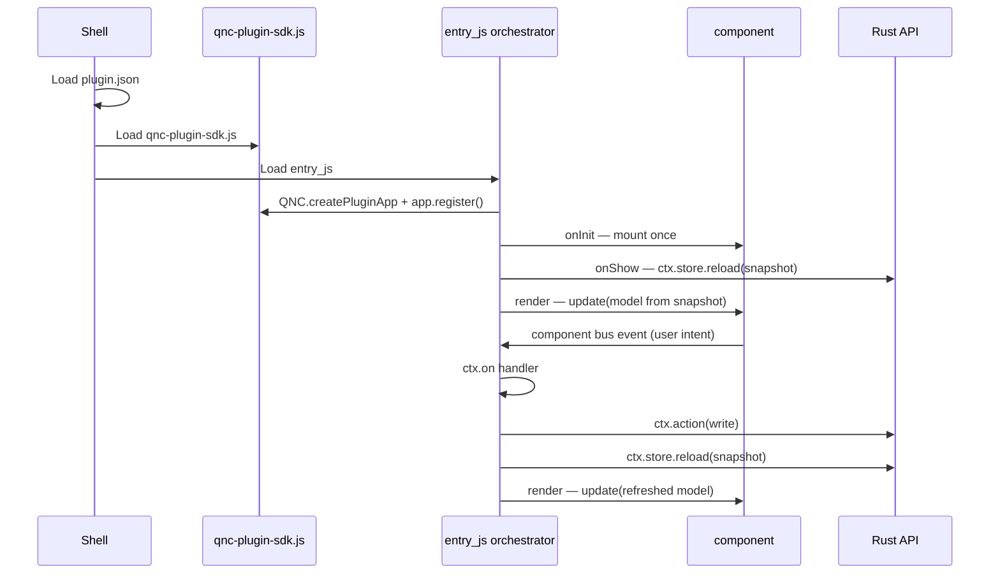

# How to create a plugin from sdk_demo

## 1. Purpose

[`plugins/sdk_demo`](../plugins/sdk_demo/) is the **smallest runnable** Plugin SDK v1 reference in this repo.

It demonstrates the full golden path:

**component event → `ctx.on` → `ctx.action` → Rust API → `ctx.store.reload` → render**

| Aspect | sdk_demo | Production plugins (e.g. ingest) |
|--------|----------|----------------------------------|
| State | Project DB / SQLite (`sdk_demo_state` in `qnc_project.db`) | SQLite / project DB via API snapshots |
| UI | One panel (`sdk-demo-panel`) | Multi-panel layout |
| Tab visibility | `enabled: false` by default | Usually always on |

Use sdk_demo to **bootstrap a new tab**. It already persists via project DB; follow the same SQLite/API pattern for production plugins.

Further reading: [plugin-sdk-v1.md](plugin-sdk-v1.md), [developer-components.md](developer-components.md).

---

## 2. What to copy

When starting a new plugin, copy and rename these artifacts from sdk_demo:

| Area | Path |
|------|------|
| Plugin folder | `plugins/sdk_demo/` → `plugins/<plugin_id>/` |
| Tab layout component | `app/components/sdk-demo-tab-layout/` |
| Panel component | `app/components/sdk-demo-panel/` |
| Rust host module | `qnc-host/src/sdk_demo/` |
| Registry entries | `app/components/registry.json` (two component blocks) |
| Router registration | `qnc-host/src/main.rs` — `mod …` + `.merge(…::router())` |
| Integration tests | `test.ps1` — snapshot/action/module smoke checks |

Do **not** copy ingest or media_pool wholesale — they are larger references for other stages.

---

## 3. Rename checklist

Example: turning sdk_demo into a hypothetical **Notes** plugin.

| From (sdk_demo) | To (notes) |
|-----------------|------------|
| `plugin_id`: `sdk_demo` | `notes` |
| `tab_id`: `sdk_demo` | `notes` |
| Folder: `plugins/sdk_demo/` | `plugins/notes/` |
| Label: `SDK Demo` | `Notes` |
| `panel_id`: `panel-sdk-demo` | `panel-notes` |
| `api_namespace`: `/api/sdk-demo` | `/api/notes` |
| API paths: `/api/sdk-demo/state` | `/api/notes/state` |
| Snapshot key: `sdk_demo.state` | `notes.state` |
| Actions: `sdk_demo.increment`, `sdk_demo.reset` | `notes.save`, `notes.delete` (or your domain verbs) |
| Component ids: `sdk-demo-panel`, `sdk-demo-tab-layout` | `notes-panel`, `notes-tab-layout` |
| JS file: `qnc-sdk-demo.js` | `qnc-notes.js` |
| Rust module: `qnc-host/src/sdk_demo/` | `qnc-host/src/notes/` |
| `data-qnc-panel` selectors | Match new component ids |
| `PLUGIN_CTX.pluginId` / `createPluginApp({ pluginId })` | `notes` |

**Naming conventions:**

- `plugin_id` / folder: **underscore** (`sdk_demo`, `media_pool`)
- Component ids / API namespace: **hyphen** (`sdk-demo-panel`, `/api/sdk-demo`)
- Event/action strings: usually **`plugin_id` + dot + verb** (`sdk_demo.increment`)

---

## 4. Required files

Minimal set for a new SDK v1 tab (same shape as sdk_demo):

```
plugins/<plugin_id>/
  plugin.json
  static/qnc-<plugin_id>.js      # orchestrator (QNC.createPluginApp)
  static/qnc-<plugin_id>.css     # optional

app/components/<plugin>-tab-layout/
  component.html
  component.css                  # optional

app/components/<plugin>-panel/
  component.html
  component.js                   # mount/update + component bus emit
  component.css

qnc-host/src/<module>/
  mod.rs                         # pub use api::router;
  store.rs                       # read/write state (SQLite / project DB)
  api.rs                         # Axum routes

app/components/registry.json     # entries for layout + panel
qnc-host/src/main.rs             # mod + merge router
test.ps1                         # smoke tests for your API + module enable
```

---

## 5. Golden path code flow

Runtime sequence (same for sdk_demo and production plugins):



In code (sdk_demo pattern):

1. Shell discovers `plugins/<id>/plugin.json` and injects `panel_html` + scripts.
2. `QNC.createPluginApp({ pluginId, tabId, apiNamespace, snapshots, snapshotLoaders })`.
3. `onInit` — `comp('…')?.mount?(...)` once; register `ctx.on('event', …)`.
4. `onShow` — `await ctx.store.reload('<snapshot.key>')`; `renderAll(ctx)`.
5. User clicks → component emits e.g. `sdk_demo.increment` via `QNC.emitComponent`.
6. Handler calls `await ctx.action('sdk_demo.increment', { project_id, … })`.
7. Handler calls `await ctx.store.reload('sdk_demo.state')`.
8. `renderAll` reads `ctx.store.get('sdk_demo.state')` and passes data to `comp(…)?.update?(...)`.
9. `onDestroy` — `ctx.teardown()`.

---

## 6. Manifest checklist

Compact annotated `plugin.json` (adapt from sdk_demo):

```json
{
  "plugin_id": "notes",
  "tab_id": "notes",
  "label": "Notes",
  "enabled": false,
  "entry_js": "/plugins/notes/static/qnc-notes.js",
  "panel_id": "panel-notes",
  "api_namespace": "/api/notes",
  "panel_html": "/app/components/notes-tab-layout/component.html",
  "uses_components": ["shell-plugin-tab", "notes-tab-layout", "notes-panel"],
  "sdk_version": 1,
  "state": {
    "snapshots": [
      {
        "key": "notes.state",
        "method": "GET",
        "path": "/api/notes/state",
        "query": ["project_id"]
      }
    ],
    "invalidates_on": ["project:changed"]
  },
  "backend": {
    "actions": [
      {
        "action": "notes.save",
        "method": "POST",
        "path": "/api/notes/save",
        "writes": ["notes.body"]
      }
    ]
  }
}
```

| Field | Role |
|-------|------|
| `plugin_id` | Bus routing, component context, module id |
| `tab_id` | Footer tab id (often same as `plugin_id`; media_pool uses `pool`) |
| `label` | Footer label |
| `enabled` | `false` hides tab until `POST /api/modules/<tab_id>/enable` |
| `api_namespace` | Prefix for relative paths in SDK |
| `panel_html` | Layout HTML with `[data-qnc-panel="…"]` slots |
| `uses_components` | Must match `registry.json` ids |
| `sdk_version` | `1` — marks SDK intent |
| `state.snapshots` | Document GET loaders for `ctx.store` |
| `backend.actions` | Document POST handlers for `ctx.action` |

---

## 7. Component checklist

Each panel under `app/components/<id>/`:

- [ ] **`update(root, model, { pluginId })`** — receives snapshot fields only; no fetch inside component.
- [ ] **`mount(root, ctx)`** — bind DOM once; call `update` on subsequent renders.
- [ ] **Events only out** — `QNC.emitComponent(pluginId, panelId, 'notes.save', payload)`.
- [ ] **No backend calls** — no `QNC.api`, no `fetch`, no SQLite.
- [ ] **`owns_state: false`** in `registry.json` `contract`.
- [ ] **Registered** in `app/components/registry.json` with `inputs`, `events`, assets.
- [ ] **Listed** in plugin `uses_components`.

See [developer-components.md](developer-components.md) for global component rules.

---

## 8. Backend checklist

Rust module under `qnc-host/src/<module>/`:

- [ ] **GET snapshot route** — e.g. `/api/notes/state?project_id=` returns full UI model JSON.
- [ ] **POST action routes** — one route per `backend.actions[].action`; return updated snapshot or enough data to reload.
- [ ] **Validate `project_id`** — reuse pattern from `ingest/api.rs` (`resolve_project_id`).
- [ ] **Return consistent JSON** — include `project_id` in snapshot responses.
- [ ] **Register router** — `main.rs`: `mod notes;` and `.merge(notes::router())`.

| Persistence | When |
|-------------|------|
| SQLite / project DB | **Required** — sdk_demo uses `qnc_project.db` (`sdk_demo_state`); production plugins follow `ingest` store layer per [architecture-db-first.md](architecture-db-first.md) |

sdk_demo counter survives host restart for the same project. Do not use in-memory stores or plugin-local objects as workflow state.

---

## 9. Test checklist

Add smoke checks to `test.ps1` (see sdk_demo block):

- [ ] Module listed in `GET /api/modules` with expected default `enabled`.
- [ ] Tab hidden in `GET /api/shell/tabs` when disabled.
- [ ] `GET /api/<namespace>/state?project_id=<id>` returns expected fields.
- [ ] `POST` action mutates state; response reflects change.
- [ ] `GET …/static/qnc-<plugin>.js` contains `QNC.createPluginApp`.
- [ ] `POST /api/modules/<tab_id>/enable` `{ "enabled": true }` — tab appears.
- [ ] **Cleanup** — disable module again at end of test so `module_state` in `project_store.db` is not left dirty.

Do not commit `data/project_store.db`, `data/projects.json`, or other runtime `data/*` files.

---

## 10. Common mistakes

| Mistake | Fix |
|---------|-----|
| Forgetting `sdk_version: 1` | Add to manifest; documents SDK intent |
| Mixing `plugin_id` and `tab_id` | Same unless you have a deliberate split (see media_pool) |
| Missing `registry.json` entries | Shell cannot load component JS/CSS |
| Local JS object as source of truth | Only snapshot from `ctx.store.get` drives `update()` |
| Calling another plugin’s API/JS | Use shell bus + shared project id + DB |
| `ctx.action` for GET lists | Use `ctx.api.get(path, query)` or a store snapshot loader |
| No `ctx.store.reload` after write | UI stays stale until manual refresh |
| Mount on every render | Mount once in `onInit`; only `update` in render |
| Wrong `[data-qnc-panel]` selector | Must match component `PANEL_ID` in JS |
| Committing `data/*` | Runtime artifacts — keep out of git |

---

## 11. Next steps

| Goal | Reference |
|------|-----------|
| Minimal single-panel plugin | **sdk_demo** — copy this guide |
| Production multi-panel tab | **ingest** — [`plugins/ingest`](../plugins/ingest/), [plugin-sdk-v1.md](plugin-sdk-v1.md) |
| Partial SDK migration (known JS cache gaps) | **media_pool** — read only; do not copy as primary template yet |
| Component contracts | [developer-components.md](developer-components.md) |
| Shell tabs / buses | [shell-spec-v1.md](shell-spec-v1.md) |

Suggested path after your first sdk_demo clone:

1. Get snapshot + one write action working end-to-end.
2. Wire SQLite persistence from the start (ingest `store.rs` pattern).
3. Add panels incrementally; keep orchestrator thin.
4. Enable tab (`enabled: true` or module API) when ready for users.
